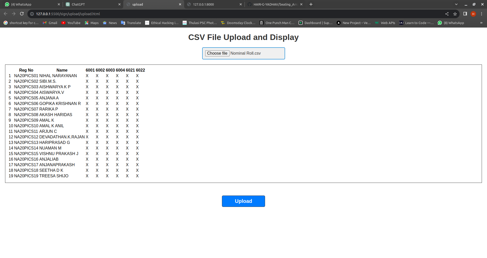
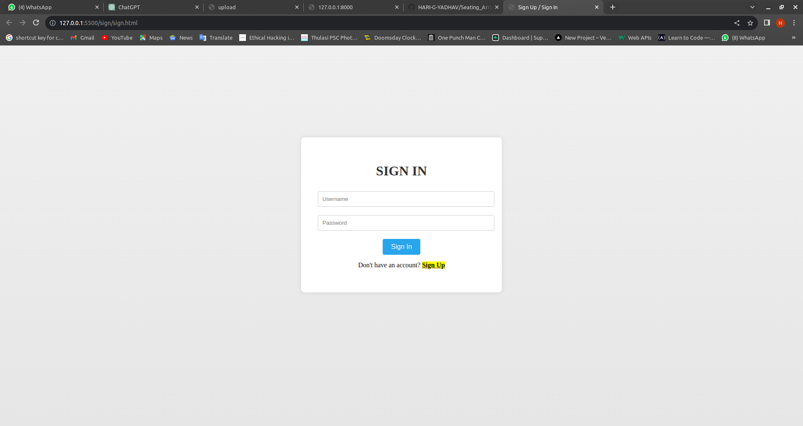

# Seating Arranger

An web app which will arrange the seating for exam


## Authors

- [@HARI-G-YADHAV](https://www.github.com/HARI-G-YADHAV)
- [@HARI-G-YADHAV](https://www.github.com/vishnuprakash-777)


## Screenshots





## Tech Stack

**Client:** HTML,CSS,JS

**Server:** DJANGO


## Run Locally

Clone the project

```bash
  git https://github.com/HARI-G-YADHAV/Seating_Arranger.git
```

Go to the Django directory

```bash
  cd backend
```

Go to the Front End directory

```bash
  cd sign
```


Install Required Packages 

```bash
  pip3 install -r requirement.txt
```

Start the server in debug mode

```bash
  pip3 manage.py runserever 8000

```


## Bugs
Only able to use in google chrome *FIXED*
